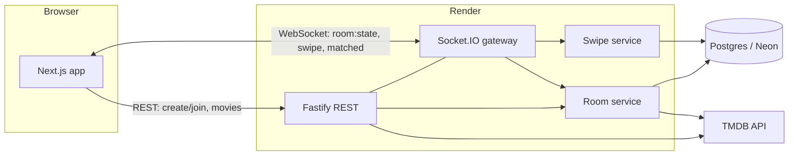

# Movie Night Matcher

Swipe through movies together in real time. The first movie everyone in the room likes wins, and the match screen shows where it's streaming in India.

**Live demo:** [movie-night-matcher-eta.vercel.app](https://movie-night-matcher-eta.vercel.app) · API on Render (free tier: the first request after idle takes ~50s to wake)

## How it works

- **Rooms.** The host picks genres, a language and (optionally) streaming services, then shares a 6-character code or invite link. Friends join with just a nickname.
- **One shared deck.** The server builds a single deck from TMDB's discover API, so everyone swipes the same movies in the same order.
- **Unanimous, first hit wins.** As soon as every active member has liked the same movie, the room matches and shows where to stream, rent or buy it.

## Architecture



An npm-workspaces monorepo:

| Package | What it is |
|---|---|
| `packages/shared` | zod schemas and TypeScript types for every REST payload and socket event, used by both apps |
| `apps/api` | Fastify + Socket.IO on one Node process, Prisma 7 over Postgres |
| `apps/web` | Next.js App Router client that renders whatever `room:state` snapshot the server sends |

Postgres is the source of truth. The server never trusts client state: every connect gets a fresh snapshot built from the database.

## Race-safe matching

The tricky case is two people sending the final like at the same moment. Under Postgres's default `READ COMMITTED` isolation, each transaction inserts its own swipe and then counts likes, but neither can see the other's uncommitted insert. Both count one short, neither sees a full house, and **the match is silently lost**.

Every swipe transaction therefore starts by row-locking the room:

```sql
SELECT status, deck, "matchedMovieId", "hostId", page FROM "Room" WHERE id = $1 FOR UPDATE
```

That serializes all round-changing writes (swipes, re-checks when someone leaves, restarts) per room, while different rooms still run in parallel. The final transition is a conditional `UPDATE … WHERE "matchedMovieId" IS NULL`, so a room can match at most once.

This is proven by a test, not just argued: [`apps/api/tests/swipes.test.ts`](apps/api/tests/swipes.test.ts) fires two final likes concurrently ten times and requires exactly one match every time. With `FOR UPDATE` removed, that test failed in 3 out of 3 runs with `expected [] to have a length of 1 but got +0`, i.e. zero matches.

## Reconnects and presence

- **Snapshot on every connect.** Refreshing mid-deck resumes at the exact card, because position is derived from the swipes stored in Postgres.
- **15-second grace period.** A dropped connection marks the member inactive only if they haven't reconnected, so flaky mobile networks don't bounce people in and out.
- **Multiple tabs.** A member stays active while any of their tabs is still connected.
- **Departures can complete a match.** When someone leaves, the server re-checks the deck against the smaller group.
- **Host handoff.** If the host leaves, the earliest-joined active member becomes host, so the room can still start or load more movies.
- **Resync.** If a stale client swipes the wrong card, the server rejects it (`NOT_IN_DECK` / `OUT_OF_ORDER`) and the client pulls a fresh snapshot via `room:sync`.

## Local setup

Requires Node ≥ 22 and Docker.

```bash
npm run db:up                                   # Postgres 17 on localhost:5433
cp apps/api/.env.example apps/api/.env          # add a TMDB v3 key and `openssl rand -hex 32` as JWT_SECRET
cp apps/web/.env.example apps/web/.env.local
npm install
cd apps/api && npx prisma migrate dev && cd ../..
npm run dev:api                                 # http://localhost:4000
npm run dev:web                                 # http://localhost:3000
```

## Tests

```bash
npm test                                # every workspace
npm run test:coverage -w @mnm/api       # API unit, integration and socket tests with coverage
npm run e2e -w @mnm/web                 # Playwright: two browsers reach a match against a fake TMDB
```

The API suite runs against a real Postgres (`mnm_test`), including the concurrency test above and multi-client Socket.IO tests for match, reconnect, grace-period and host-handoff flows.

## Tech stack

TypeScript · Node.js · Fastify 5 · Socket.IO 4 · Prisma 7 · PostgreSQL 17 · zod 4 · Next.js 16 · React 19 · Tailwind CSS 4 · Motion · Vitest · Playwright · GitHub Actions

This product uses the TMDB API but is not endorsed or certified by TMDB. Streaming availability data is provided by JustWatch.
